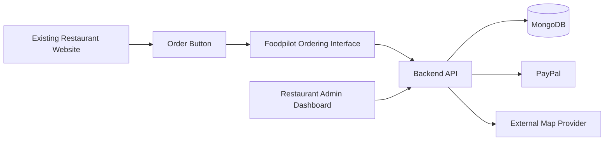

# Architecture

## Purpose

This document describes the MVP architecture of Foodpilot.

Foodpilot is a modern, open-source and self-hostable ordering platform for restaurants, takeaway businesses and food trucks.

The architecture is designed around one clear product idea:

```text
existing restaurant website
→ order button
→ Foodpilot ordering interface
→ checkout
→ restaurant operations
→ pickup or delivery
```

Foodpilot is not a marketplace, not a restaurant discovery platform, not a delivery network and not a full restaurant website builder.

---

## Product Scope

The MVP supports:

- one restaurant business
- one active location
- fixed restaurants and mobile food trucks
- one menu structure
- customer ordering
- guest checkout
- customer accounts
- pickup
- delivery
- PayPal and cash payment
- restaurant admin operations
- drivers
- delivery tours
- verified customer reviews
- delivery and pickup time estimation
- self-hosted deployment

The system is intentionally built as a focused ordering and operations platform.

---

## Non Goals

The MVP does not include:

- restaurant marketplace functionality
- public restaurant discovery
- restaurant-independent driver pools
- full website builder functionality
- content management for restaurant websites
- native driver app requirement
- live GPS tracking
- internal traffic-aware route optimisation
- automatic stop reordering
- complex multi-tenant marketplace operations

External tools such as Google Maps, Mapbox or HERE may be used for navigation or travel-time estimates.

---

## High-Level Architecture

Foodpilot is split into four main areas:

```text
Customer Ordering Interface
Restaurant Admin Dashboard
Backend API
Database
```

A typical deployment looks like this:



The restaurant website remains independent. Foodpilot only provides the ordering and operational flow.

---

## Main Applications

### Customer Ordering Interface

The customer ordering interface is the public ordering flow.

It allows customers to:

- view the active menu
- select products and options
- add items to a cart
- choose pickup or delivery
- enter customer details
- enter a delivery address when required
- select a payment method
- place an order
- receive an order confirmation
- review eligible completed orders when logged in

The ordering interface is accessed through a link or button embedded on an existing restaurant website.

Example:

```text
https://foodpilot.org/{restaurantSlug}
```

A self-hosted deployment may use its own domain or subdomain.

---

### Restaurant Admin Dashboard

The restaurant admin dashboard is used for daily operations.

Restaurant users can manage:

- restaurant profile
- active location
- saved locations
- opening hours
- order acceptance status
- preorder settings
- delivery and pickup settings
- delivery radius
- menu categories
- menu items
- product availability
- optional inventory tracking
- orders
- payments
- drivers
- delivery tours
- customer information
- reviews and moderation visibility where allowed

Restaurant users are separate from customers.

---

### Backend API

The backend API is the central application layer.

It is responsible for:

- loading restaurant and location configuration
- serving the public ordering interface with menu data
- validating carts
- validating pickup and delivery availability
- validating delivery radius
- creating orders
- handling payment state
- reserving and releasing optional inventory
- calculating fulfilment estimates
- assigning delivery orders to delivery tours
- updating order status
- managing drivers and tours
- exposing admin operations
- enforcing permissions
- storing immutable snapshots
- validating review eligibility

All business rules are enforced by the backend API, not by the frontend alone.

---

### Database

Foodpilot uses MongoDB-style document collections for the MVP.

The main collections are:

```text
restaurants
locations
restaurantUsers
customers
passwordResetTokens
menuCategories
menuItems
orders
payments
inventoryReservations
orderCounters
drivers
deliveryTours
reviews
```

The detailed collection models are documented separately in `docs/database`.

---

## Core Data Ownership

### Restaurant

The restaurant is the central business entity.

It owns:

- locations
- restaurant users
- menu categories
- menu items
- orders
- payments
- inventory reservations
- order counters
- drivers
- delivery tours
- reviews

The MVP follows a single-restaurant deployment model by default.

---

### Location

A location represents the operational origin for orders.

It may be:

- a fixed restaurant address
- a fixed takeaway location
- the current or recurring operating point of a food truck

A restaurant may store multiple locations, but customer ordering uses one active location at a time.

The active location defines:

- address
- coordinates
- opening hours
- order acceptance status
- preorder settings
- delivery settings
- pickup availability
- delivery availability
- delivery radius

Checkout is only possible when the restaurant has a valid active location.

---

### Menu

The menu consists of:

- `menuCategories`
- `menuItems`

Menu items belong to a restaurant and a category.

Menu items define:

- product name
- price
- labels
- options
- availability status
- optional inventory tracking

Unavailable product visibility is configured at restaurant level.

---

### Customer

Customers may order as guests or with registered accounts.

Guest checkout is supported to reduce friction.

Registered customer accounts are required for:

- account features
- saved customer data
- verified reviews

Customer records are kept separate from restaurant users.

---

### Order

Orders are the central operational record.

An order stores:

- restaurant reference
- location reference
- customer reference or guest snapshot
- location snapshot
- customer snapshot
- delivery address snapshot
- ordered items snapshot
- status history
- payment status
- fulfilment estimate history
- optional delivery tour reference

Snapshots preserve historical correctness even when menu, customer or location data changes later.

---

### Payment

Payments are stored separately from orders.

The MVP supports:

- PayPal
- cash payment

The order stores the payment state, while the `payments` collection stores payment attempts and provider references.

Online payment providers are external integrations and should not be treated as the source of order truth.

The order remains the source of truth for the fulfilment process.

---

### Inventory Reservation

Inventory reservations are used when optional product-level inventory tracking is enabled.

A reservation can temporarily hold stock during checkout or payment.

Reservations protect the system from overselling limited products while still allowing incomplete checkouts to expire cleanly.

Inventory tracking is optional and not required for all menu items.

---

### Driver

Drivers are operational resources of a restaurant.

Drivers are managed by restaurant users and do not require their own login in the MVP.

A driver has:

- name
- optional phone number
- vehicle type
- duty status
- active flag

Driver availability is derived from:

- `isActive`
- `dutyStatus`
- active and planned delivery tours

---

### Delivery Tour

A delivery tour represents one physical delivery run.

A tour:

- starts at the active restaurant location
- contains one or more delivery stops
- may be assigned to a driver
- may be planned before the driver starts
- may be open or closed for adding more orders
- ends when the driver returns or the tour is completed operationally

Orders do not store a direct `driverId`.

The assigned driver is resolved through:

```text
order → deliveryTour → driver
```

This keeps order assignment flexible and allows reassignment history to remain traceable.

---

### Review

Reviews are stored separately from orders.

A review can only be created by a registered customer for their own successfully completed order.

Eligible successful order statuses are:

```text
delivered
picked_up
```

Guest orders cannot receive reviews in the MVP.

Reviews are published by default and can be hidden through platform moderation.

Hidden and soft-deleted reviews are excluded from public rating statistics.

---

## Customer Ordering Flow

The customer ordering flow is:

```text
open ordering page
→ load active restaurant and location
→ load available menu
→ build cart
→ choose pickup or delivery
→ enter customer details
→ validate availability
→ estimate fulfilment time
→ choose payment method
→ create order
→ process payment if required
→ confirm order
```

For pickup orders:

```text
order.deliveryTourId = null
```

For delivery orders:

```text
order.deliveryTourId = ObjectId | null
```

A delivery order may be assigned to a delivery tour during dispatch planning.

---

## Restaurant Operations Flow

Restaurant users manage incoming orders through the admin dashboard.

A typical order flow is:

```text
new
→ accepted
→ preparing
→ ready
→ picked_up
```

For delivery:

```text
new
→ accepted
→ preparing
→ ready
→ out_for_delivery
→ delivered
```

If delivery fails:

```text
out_for_delivery
→ delivery_failed
```

A failed delivery can either be retried through a new tour or cancelled if no retry is planned.

---

## Payment Flow

The MVP supports PayPal and cash.

### Online Payment

The online payment flow is:

```text
cart validation
→ order created as awaiting payment
→ payment attempt created
→ PayPal payment flow
→ payment confirmation
→ order becomes processable
```

The backend must verify payment state before treating an online payment order as valid for fulfilment.

### Cash Payment

Cash payment can be used where allowed by restaurant configuration.

Cash payment rules are enforced by the backend.

For risk control, pickup with cash can be restricted for guests or customers without successful order history.

---

## Pickup Flow

Pickup orders do not use delivery tours.

The system estimates when the order will be ready.

The customer receives an estimated pickup time.

The restaurant marks the order as picked up after handover.

Successful pickup orders can count toward customer statistics and review eligibility.

---

## Delivery Flow

Delivery orders require:

- delivery enabled on the active location
- valid delivery address
- delivery address within radius when a radius is configured
- delivery availability strategy
- active on-duty driver availability or valid operational handling

Delivery orders may be grouped into delivery tours.

A tour may contain multiple stops.

The route can be handed off to an external navigation tool.

Foodpilot does not perform exact real-time navigation in the MVP.

---

## Delivery Estimation

Delivery and pickup estimates are documented in:

```text
docs/algorithms/delivery-estimation.md
```

The MVP estimate is intentionally transparent.

Pickup estimation uses:

```text
preparation time
+ kitchen load buffer
+ safety buffer
```

Delivery estimation additionally uses:

```text
driver availability delay
+ delivery travel time
```

Estimates are stored in `orders.fulfilmentEstimateHistory`.

Meaningful changes create a new history entry.

---

## Preorder Flow

Preorders are configured on the active location.

A preorder must be validated against:

- active location
- opening hours
- opening hour exceptions
- timezone
- order acceptance status
- pickup availability
- delivery availability
- delivery radius for delivery orders
- preorder settings
- payment method rules

In the MVP, preorders are only supported where online payment is available.

Cash payment is not offered for preorders.

The requested fulfilment time must be realistic according to the same preparation, load and delivery estimation rules used for normal orders.

---

## Review Flow

The review flow is:

```text
registered customer logs in
→ completed order is loaded
→ eligibility is checked
→ review is created
→ review is published
```

A review requires:

- registered customer
- completed order
- order belongs to the customer
- order has no existing review
- order status is `delivered` or `picked_up`

Reviews are not created through public anonymous links in the MVP.

---

## Authentication and Permissions

Foodpilot separates three user concepts:

```text
restaurant users
customers
guests
```

### Restaurant Users

Restaurant users access the admin dashboard.

Roles:

```text
main_admin
operator
```

Restaurant users can manage restaurant operations according to their role.

### Customers

Customers can create accounts and log in for customer-facing features.

Registered customers can leave verified reviews for eligible completed orders.

### Guests

Guests can place orders without creating an account.

Guest checkout does not grant account-only features such as verified reviews.

---

## External Integrations

The MVP architecture allows external integrations without making them core dependencies of the domain model.

### Payment Provider

PayPal is supported in the MVP.

Additional payment providers may be added later.

### Map Provider

External map providers may be used for:

- distance calculation
- travel-time estimation
- opening a route for drivers
- passing multiple stops to a navigation app

Possible providers include:

- Google Maps
- Mapbox
- HERE

Foodpilot stores operational data and estimates, not live navigation state.

---

## API Boundaries

The backend should expose separate API areas for:

```text
public ordering
customer account
restaurant admin
payment callbacks
driver/tour operations
```

The public ordering API must only expose customer-safe restaurant and menu data.

The admin API requires restaurant-user authentication.

Payment callbacks must be verified server-side.

Operational actions that change order, payment, inventory, tour or review state must be performed through the backend.

---

## State and History

Foodpilot stores history where operational traceability matters.

Orders store:

- status history
- fulfilment estimate history
- delivery assignment history

Delivery tours store:

- stop status
- stop timestamps
- tour status timestamps

Reviews store:

- moderation state
- deletion state

This keeps important business events traceable without requiring a separate event-sourcing system in the MVP.

---

## Validation Principles

The backend must validate:

- active restaurant state
- active location state
- opening hours and exceptions
- order acceptance status
- pickup availability
- delivery availability
- delivery radius
- menu item availability
- option validity
- price snapshots
- inventory reservation state
- payment state
- customer permissions
- restaurant-user permissions
- delivery tour ownership
- review eligibility

Frontend validation may improve user experience, but backend validation is authoritative.

---

## Self-Hosting

Foodpilot is designed to be self-hostable.

A self-hosted deployment includes:

- web application
- backend API
- MongoDB database
- environment configuration
- payment provider credentials
- optional map provider credentials
- file/static asset handling where needed
- reverse proxy and HTTPS setup in production

The project may also have a hosted reference deployment, but the architecture must not depend on a central marketplace infrastructure.

---

## Documentation Map

Detailed documentation is split by responsibility:

```text
docs/vision.md
docs/roadmap.md
docs/database/customer.md
docs/database/menu.md
docs/database/order.md
docs/database/restaurant.md
docs/database/driver.md
docs/database/reviews.md
docs/database-uml.md
docs/algorithms/delivery-estimation.md
docs/architecture.md
```

Collection-specific rules belong in the database documentation.

Cross-cutting system behavior belongs in architecture or algorithm documentation.

---

## Later Extensions

The MVP architecture intentionally leaves room for later extensions:

- multiple active workflows for more complex multi-location operations
- advanced route optimisation
- automatic stop ordering
- live GPS tracking
- native driver app
- push notifications
- additional payment providers
- card payments through payment providers
- customer-facing live delivery tracking
- guest review tokens
- restaurant replies to reviews
- moderation audit logs
- analytics and reporting
- stronger role and permission models
- multi-restaurant hosted operation

These extensions should build on the MVP architecture without changing the core idea of Foodpilot as a focused ordering and operations platform.

---

## Summary

Foodpilot is built around a simple architecture:

```text
existing restaurant website
→ Foodpilot ordering interface
→ backend API
→ operational database
→ restaurant admin dashboard
→ pickup or delivery fulfilment
```

The MVP keeps the system focused and understandable.

It supports ordering, payment, pickup, delivery, drivers, delivery tours, estimates and verified reviews without becoming a marketplace, delivery network or website builder.

The architecture prioritises clear ownership, traceable operational state and self-hostable deployment.
