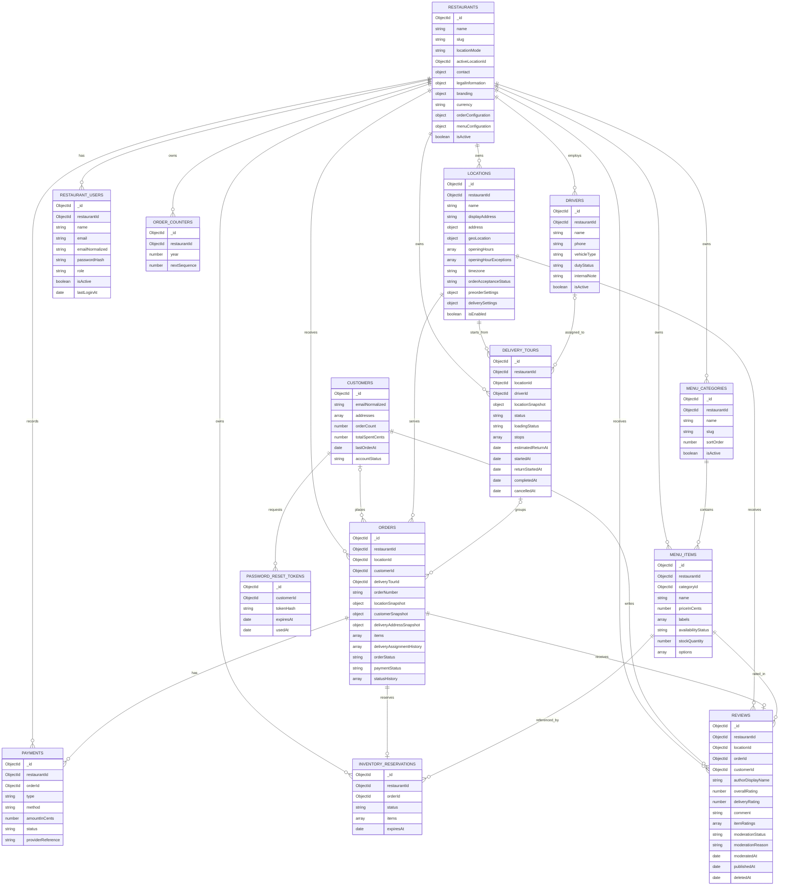

````md
# Foodpilot Collections UML

This diagram reflects the current documentation state.



## Notes

- `restaurants`, `locations`, and `restaurantUsers` are documented in `docs/database/restaurant.md`.
- `drivers` and `deliveryTours` are documented in `docs/database/driver.md`.
- `reviews` are documented in `docs/database/reviews.md`.
- `orders.locationSnapshot`, `orders.customerSnapshot`, `orders.deliveryAddressSnapshot`, and `orders.items[]` preserve immutable historical data.
- `deliveryTours.locationSnapshot` and `deliveryTours.stops[].deliveryAddressSnapshot` preserve the location and customer-address data used during dispatch.
- Delivery orders reference the currently assigned tour through `orders.deliveryTourId`.
- Orders do not store `driverId`. The assigned driver is resolved through `order → deliveryTour → driver`.
- `orders.deliveryAssignmentHistory` is embedded in the order document and preserves reassignment history.
- `deliveryTours.stops[]` is embedded in the tour document and stores stop sequence, stop state, address snapshots, and delivery timestamps.
- `reviews.itemRatings[]` is embedded in the review document and stores optional ratings for individual ordered products.
- Reviews can only be created by registered customers for their own successfully completed orders.
- Guest checkout remains supported, but guest orders cannot receive reviews in the MVP.
- Reviews are published automatically and can only be hidden through platform moderation.
- Hidden and soft-deleted reviews are excluded from public rating statistics.
- `customers` currently follows the single-restaurant deployment model and therefore does not require a `restaurantId`.
```
````
