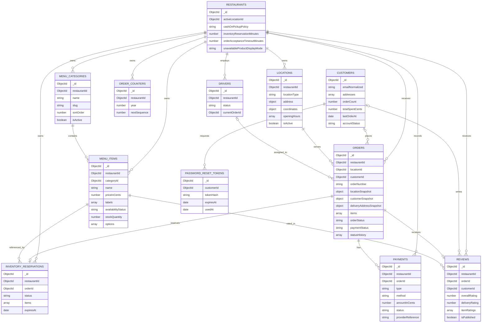

# Foodpilot Collections UML

This diagram reflects the current documentation state. Models that are not fully specified yet are marked as planned.

## Notes

- `restaurants`, `locations`, and `drivers` are still provisional because their dedicated documentation files have not been finalized.
- `orders.locationSnapshot`, `orders.customerSnapshot`, and `orders.items[]` preserve immutable historical data.
- `customers` currently follows the single-restaurant deployment model and therefore does not yet require a `restaurantId`.
- Driver assignment is planned and will be finalized in `docs/database/driver.md`.
